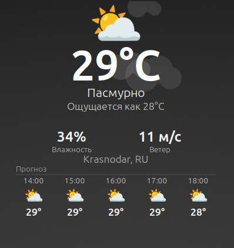

# ☀️ Animated Weather Desklet for Cinnamon

A beautiful, real-time animated weather desklet for Linux Mint Cinnamon desktop. Features live particle effects (rain, snow, drifting clouds, twinkling stars), glassmorphism UI, auto-detection of your location, and **full Russian language support**.




## ✨ Features

- **Live animated weather** — rain drops, snowflakes, drifting clouds, twinkling stars at night
- **Transparent background mode** — toggle off the sky gradient and glass panel for a clean, floating look. Unlike other desklets, no visible container borders or backgrounds
- **Glassmorphism UI** — frosted glass panel with adaptive transparency
- **Sky gradient** — dynamic sky colours that adapt to weather condition and time of day
- **Auto location** — detects your city via IP geolocation (or set manually)
- **Real-time data** — powered by Open-Meteo (free, no API key required)
- **Hourly forecast** — 6/12/24 hour forecast strip, 8 slots
- **Configurable** — units, theme (Auto/Glass/Dark), opacity, background toggle, width, refresh interval
- **🌐 Russian language** — interface and settings available in Русский
- **Lightweight** — ~30fps Cairo-rendered, no GPU needed
- **No API key required** — Open-Meteo is free and works everywhere (including Russia, China, etc.)

## 📦 Installation

### Prerequisites

- **Linux Mint 20+** (or any Cinnamon desktop ≥ 4.6)
- **Internet connection** (for weather data)

### Install

```bash
# Clone and install in one go
git clone https://github.com/Zulus-Code/cinnamon-animated-weather-desklet.git \
  ~/.local/share/cinnamon/desklets/weather-animated@zulus/

# Restart Cinnamon
Ctrl+Alt+Esc
```

> ⚠️ **Note:** The one-liner `curl | bash` method is no longer recommended. Use `git clone` for reliable installation and easy updates (`git pull`).

### Activate

1. Right-click on desktop → **Add Desklet**
2. Find **Анимированная погода** (or **Animated Weather**) → click **Add**
3. Right-click the desklet → **Configure**
4. Choose your **city** (or leave `auto`)
5. Select **Language** → **Русский** (optional)

That's it — no API key needed. Works out of the box.

### Updating

```bash
cd ~/.local/share/cinnamon/desklets/weather-animated@zulus/
git pull
Ctrl+Alt+Esc
```

## 🌐 Internationalisation

The desklet supports **English** and **Russian** interface languages.

**For the Cairo-rendered UI** (temperatures, labels, errors):
Switch language in desklet settings: **Configure → Language → Русский**

**For the settings dialog** (descriptions, tooltips):
Install gettext and compile the translations:
```bash
sudo apt install gettext
msgfmt ~/.local/share/cinnamon/desklets/weather-animated@zulus/po/ru.po \
  -o ~/.local/share/locale/ru/LC_MESSAGES/weather-animated@zulus.mo
Ctrl+Alt+Esc
```

When switching to Russian:
- Wind unit changes from `km/h` to `м/с`
- Pressure unit changes from `hPa` to `гПа`
- All labels, errors, and loading messages are translated
- Settings dialog descriptions and tooltips are translated (with `msgfmt`)

## ⚙️ Configuration

| Setting | Default | Description |
|---------|---------|-------------|
| Location | `auto` | City name, `lat,lon` coordinates, or `auto` for IP geolocation |
| Units | Celsius | °C or °F |
| Language | English | Interface language (English / Русский) |
| Refresh | 10 min | How often to fetch weather data |
| Theme | Auto | Auto (adapts), Glass (always light), Dark |
| Forecast | ✅ On | Show hourly forecast strip |
| Forecast hours | 6 h | Forecast range (3–24 h) |
| Background | ✅ On | Show sky gradient and glass panel (off = transparent, particles only) |
| Humidity | ✅ On | Show humidity |
| Wind | ✅ On | Show wind speed |
| Pressure | ✅ On | Show atmospheric pressure |
| Opacity | 70% | Panel transparency |
| Width | 350 px | Desklet width |

## 🎨 Weather Animations

| Condition | Effect |
|-----------|--------|
| ☀️ Clear (day) | Warm golden glow, subtle sparkles |
| 🌙 Clear (night) | Deep blue sky, twinkling stars with cross flares |
| ☁️ Cloudy | Grey-white gradient, drifting cloud clusters |
| 🌧️ Rain | Dynamic rain streaks, steel-blue sky |
| ⛈️ Thunderstorm | Heavy rain, dark turbulent sky |
| ❄️ Snow | White gradient, falling snowflakes with drift |
| 🌫️ Fog/Mist | Soft grey gradient, fog wisps |

## 🛠️ Development

The desklet is split into logical modules for maintainability:

```
weather-animated@zulus/
├── desklet.js           # Main class — wires modules together, settings, lifecycle
├── constants.js         # Colors, WMO weather codes, i18n strings, emoji map
├── weatherService.js    # Open-Meteo API, geocoding, forecast builder
├── renderer.js          # Cairo/PangoCairo rendering — sky, glass panel, text, particles
├── particleSystem.js    # Particle physics — rain, snow, clouds, stars
├── utils.js             # Helpers — text width, local date parsing
├── settings-schema.json # Settings UI definition
├── metadata.json        # Desklet metadata
├── stylesheet.css       # Container styles
├── install.sh           # Legacy installer
├── po/
│   ├── weather-animated@zulus.pot  # Gettext translation template
│   └── ru.po                       # Russian translations
├── README.md            # This file
└── LICENSE              # GPL-3.0
```

### Module roles

| Module | Lines | Responsibility |
|--------|-------|---------------|
| `desklet.js` | ~250 | Desklet class, settings binding, lifecycle, animation loop, container transparency |
| `constants.js` | ~125 | Sky/palette colors, WMO→description dict (en/ru), emoji mapping, i18n strings |
| `weatherService.js` | ~245 | Open-Meteo API fetch, geocoding (Open-Meteo + ip-api.com), WMO→OWM ID mapping, forecast builder |
| `renderer.js` | ~300 | All drawing: sky gradient, glass panel, current weather UI, forecast strip, loading/error states |
| `particleSystem.js` | ~230 | Particle classes, physics update, per-condition particle spawning |
| `utils.js` | ~50 | `_pangoWidth()`, `_parseLocalDate()`, `_getMinutes()` |

### Architecture

- **Class-based** ES6 JavaScript (Cinnamon/GJS compatible)
- **Cairo + PangoCairo rendering** — all UI drawn via Cairo on `St.DrawingArea`, text through PangoCairo for emoji support
- **Particle system** — lightweight physics for rain/snow/clouds/stars in a dedicated module
- **HTTP** — libsoup2 (queue_message) / libsoup3 (send_and_read_async) / blocking curl fallback, encapsulated in `weatherService.js`
- **i18n** — custom `STRINGS` dict + `_(key)` helper in `constants.js`; Gettext `.po` files for settings dialog
- **Weather API** — [Open-Meteo](https://open-meteo.com/) (free, no API key). Uses WMO weather codes mapped to OWM-compatible IDs for rendering compatibility
- **Geocoding** — [Open-Meteo Geocoding API](https://open-meteo.com/en/docs/geocoding-api) for city search, [ip-api.com](http://ip-api.com/) for auto-location
- **No dependencies** — pure JavaScript, no Node.js, no WebKit

## 📄 License

GNU General Public License v3.0 — see [LICENSE](LICENSE).

---

*Made by [@Zulus-code](https://github.com/Zulus-code)* • Version **2.1.0** — see [CHANGELOG](CHANGELOG.md) for release history.
